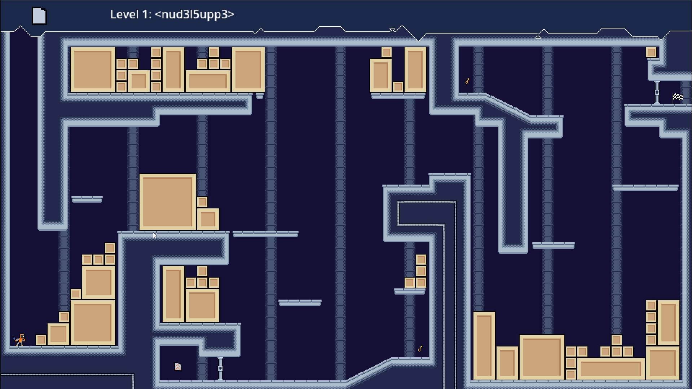

# H.O.R.S.T.
## High Operational Robot System Test

## Info

**H.O.R.S.T.** is a game developed for the [Ludum Dare 54](https://ldjam.com/events/ludum-dare/54) Game Jam with the topic *Limited Space*  in a timespan of 72 hours.

We wanted to create a platformer, which limited the amount of abilities your player character could carry at the same time. With many moderns games adding expansive skill trees H.O.R.S.T. aims to make you think about which skills to pick up and use for which situation.

The game was developed in the [Godot Game Engine](https://godotengine.org) (which unfortunately is incompatible with embedded games on Ldjam.com at the moment).

## Controls
- Navigate with A & D or Left Stick
- Jump with Space or Lower Button
- Use Abilities with F or Left Button
- Drop Abilities with 1&2 or D-Left & D-Right

---

/// 

---

## License

The source code of the game is published under the GPL v3 License.

## Links

[Cradac on Mastodon](https://dice.camp/@cradac)

[Cybermuell on Mastodon](https://layer8.space/@cybermuell)

[DorianSnowball on Mastodon](https://frameperfect.space/@DorianSnowball)

